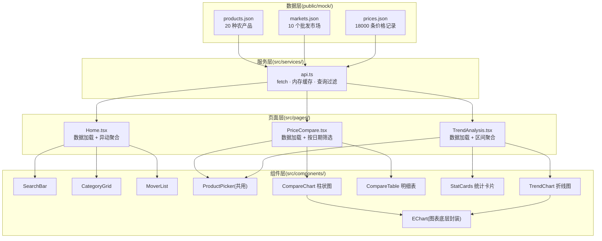
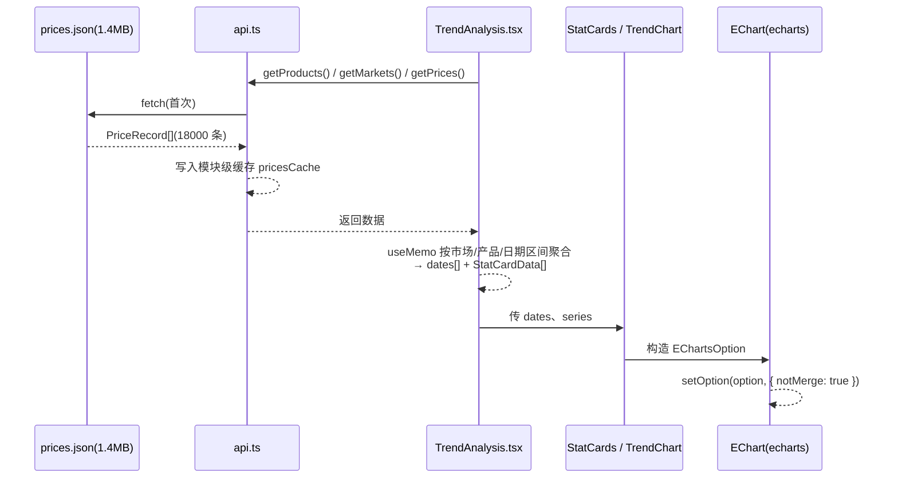
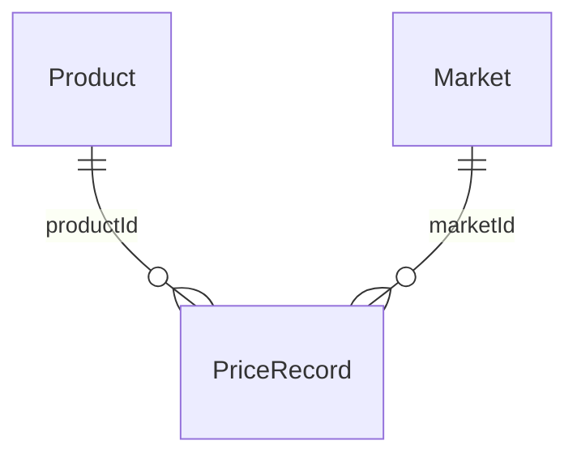

# 架构设计

> **本文档目的**:面向开发者说明技术架构——分层结构、数据流向、关键设计决策及其理由、类型系统设计。读者应先了解项目总览([README.md](./README.md))。

## 1. 整体架构

项目采用经典的前端分层:**数据层 → 服务层 → 页面层 → 组件层**,各层职责单一、单向依赖(上层不反向依赖下层实现)。



各层职责:

| 层 | 位置 | 职责 |
|---|---|---|
| 数据层 | `public/mock/*.json` | 原始数据,构建时原样复制进 dist,由浏览器直接 fetch |
| 服务层 | `src/services/api.ts` | **唯一的**数据入口:请求、缓存、按条件过滤,对上层暴露纯函数式 Promise 接口 |
| 页面层 | `src/pages/` | 加载数据、管理选中状态、用 `useMemo` 把原始记录聚合成组件可用的结构 |
| 组件层 | `src/components/` | 纯展示 + 事件回调,**不直接 fetch 数据**;图表组件只接受 `option`/数据 props |

## 2. 数据流向

以趋势分析页为例,完整链路:



要点:

1. **prices.json 全量加载一次**:文件约 1.4MB / 18000 条,`api.ts` 用模块级变量 `pricesCache` 缓存 Promise 结果,后续所有查询都在**内存中 filter**,不再发请求。三个页面共享缓存(同一 SPA 会话内);
2. **页面负责聚合**:每个页面根据自己的筛选条件(日期 / 市场 / 产品 / 区间)在 `useMemo` 中把平铺的记录聚合成图表数据,组件层拿到的已是"可直接渲染"的结构;
3. **图表组件只认 option**:业务组件构造 `EChartsOption` 传给通用封装 `EChart`,后者负责 init / setOption / resize / dispose。

## 3. 关键设计决策

### 3.1 数据层与展示层分离(api.ts 是唯一数据入口)

**决策**:所有数据请求集中在 `src/services/api.ts`,页面与组件一律不直接写 `fetch`。

**原因**:当前数据来自本地 mock,后续要换成真实行情 API(新发地、农业农村部等)。只要 API 返回结构保持不变,替换数据源时**只改 api.ts 一个文件,页面零改动**。同时便于统一处理错误、加缓存、加请求日志。

### 3.2 全量下载 + 内存过滤,而不是按需请求

**决策**:prices.json 一次下载、缓存,查询在内存里 `filter`。

**原因**:18000 条记录约 1.4MB,一次性成本可接受;换来的是筛选切换**零延迟**(无网络往返),三个页面共享同一份数据,代码简单。若接入真实 API(数据量可能大得多),此策略需要在 api.ts 内改为按查询参数请求服务端接口,页面同样不受影响。

### 3.3 路由懒加载(React.lazy)

**决策**:`App.tsx` 中三个页面全部 `React.lazy(() => import(...))`,`MainLayout` 的 `<Outlet />` 外包 `Suspense`。

```tsx
// src/App.tsx(节选)
const Home = lazy(() => import("@/pages/Home"))
const PriceCompare = lazy(() => import("@/pages/PriceCompare"))
const TrendAnalysis = lazy(() => import("@/pages/TrendAnalysis"))
```

**原因**:图表相关代码(ECharts 及两个图表组件)只被对比页/趋势页使用,懒加载后首页首屏不加载它们。**Suspense 放在 `<main>` 内而不是包裹整个布局**,保证切换页面时 Header/Footer 不闪烁,只有内容区短暂显示"页面加载中…"。优化后构建产物:入口 chunk 从 748KB 降到 41KB,三个页面各约 8KB 按需加载。

### 3.4 ECharts 按需引入 + 依赖分包

**决策**:
1. 从 `echarts/core` 引入,只注册用到的图表与组件:

```ts
// src/components/charts/EChart.tsx(节选)
import * as echarts from "echarts/core"
import { BarChart, LineChart } from "echarts/charts"
import {
  GridComponent,
  LegendComponent,
  TooltipComponent,
} from "echarts/components"
import { CanvasRenderer } from "echarts/renderers"

echarts.use([
  BarChart,
  LineChart,
  GridComponent,
  LegendComponent,
  TooltipComponent,
  CanvasRenderer,
])
```

2. `vite.config.ts` 中把 echarts 与 react 系拆成独立 chunk:

```ts
// vite.config.ts(节选)
build: {
  chunkSizeWarningLimit: 600,
  rollupOptions: {
    output: {
      manualChunks: {
        echarts: ["echarts"],
        react: ["react", "react-dom", "react-router-dom"],
      },
    },
  },
},
```

**原因**:全量引入 echarts 体积约 1MB;按需注册后本体仍约 500KB(Canvas 渲染器占大头),拆成独立 chunk 后与业务代码、React 运行时彻底分离——react chunk(约 180KB)长期不变,浏览器可长期缓存,echarts chunk 只在首次进入图表页时下载。

### 3.5 纯展示组件 + 回调(props down, events up)

**决策**:组件不持有全局数据、不直接请求,通过 props 接收数据,通过回调上报交互(如 `ProductPicker` 的 `onToggle(id)`)。

**原因**:对比页与趋势页都复用 `ProductPicker`,仅上限参数不同;图表组件完全与业务解耦。组件可独立测试、独立复用。

### 3.6 跨页传参用 URL 查询参数

**决策**:首页 → 分析页的跳转携带 `?product=ID`、`?category=分类`、`?market=ID`,目标页用 `useSearchParams` 读取并初始化选择。

**原因**:URL 即状态——用户**刷新页面后选择不丢失**,链接可直接分享;无全局状态库(Redux/Zustand)依赖,符合项目规模。

## 4. 类型系统设计

三个核心类型,集中在 `src/types/`,分别对应三份数据文件:

```ts
// src/types/product.ts
export type ProductCategory = "蔬菜" | "水果" | "粮油" | "肉禽蛋" | "水产"

export interface Product {
  id: string
  name: string
  category: ProductCategory
  unit: string
  /** 基准价(元/公斤),仅用于 mock 数据生成 */
  basePrice: number
}

// src/types/market.ts
export interface Market {
  id: string
  name: string
  city: string
  region: string
}

// src/types/price.ts
export interface PriceRecord {
  productId: string
  marketId: string
  /** YYYY-MM-DD */
  date: string
  /** 元/公斤 */
  price: number
}

export interface PriceQuery {
  productIds?: string[]
  marketIds?: string[]
  /** YYYY-MM-DD,含边界 */
  startDate?: string
  /** YYYY-MM-DD,含边界 */
  endDate?: string
}
```

关系说明:



- `PriceRecord` 是**事实表**:通过 `productId`、`marketId` 关联产品与市场,不冗余名称等信息;展示时由页面按 ID 回查 `Product` / `Market`。
- `ProductCategory` 用字符串字面量联合类型而非 `string`,分类写错会在编译期报错;`PRODUCT_CATEGORIES` 常量数组供分类 Tab 与分类卡片遍历。
- `PriceQuery` 是 api.ts 的查询入参,全部字段可选(不过滤),字段名与真实 API 常见查询参数对齐,便于后续替换。
- 日期统一为 `YYYY-MM-DD` 字符串:同格式字符串**可直接按字典序比较大小**,无需反复 `new Date()`(api.ts 与页面聚合中大量使用此特性)。
