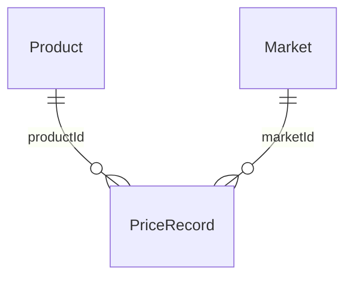

# 农价通(agri-price-tracker)软件需求规格说明书(SRS)

> 项目名称:农价通 —— 农产品价格对比与趋势分析系统
> 文档编号:SRS-02
> 版本:V1.0
> 日期:2026-09-21
> 依据标准:GB/T 9385《计算机软件需求规格说明规范》

---

## 1. 引言

### 1.1 编写目的

本文档是"农价通"系统的软件需求规格说明书,描述系统的功能需求、非功能需求、接口需求与数据需求,作为总体设计、详细设计、编码、测试与验收的依据。本文档的预期读者为:开发人员、测试人员、课程设计指导教师与评审人员。

### 1.2 项目范围

系统为一款**纯前端单页应用(SPA)**,提供以下核心服务:

1. 全国主要批发市场农产品**价格对比**(同日期、跨市场、多产品);
2. 指定市场内产品价格**趋势分析**(折线图与统计指标);
3. 产品/市场**搜索**、**分类浏览**与**价格异动榜单**等快捷入口。

### 1.3 定义与术语

| 术语 | 说明 |
|---|---|
| 产品 | 农产品品种,如猪肉、鸡蛋、大白菜,共 20 种 |
| 市场 | 批发市场,如北京新发地、上海江桥,共 10 个 |
| 价格记录 | 某产品在某市场某日的价格(元/公斤) |
| 异动榜 | 最新交易日较前一交易日全市场均价涨跌幅排行榜 |
| 时间范围 | 趋势分析的回看区间:近 7/30/90/365 天 |

### 1.4 参考资料

- 《软件工程》(张海藩)需求分析章节
- 项目《可行性分析报告》(FS-01)
- 项目《功能说明》《数据说明》文档

---

## 2. 综合描述

### 2.1 产品描述

系统以**浏览查询**为主(无注册登录、无用户数据写入),用户通过浏览器访问,在三个页面间完成:

- **首页**:搜索、分类浏览、查看价格异动榜;
- **价格对比页**:筛选产品/市场/日期,查看柱状对比图与价格明细表;
- **趋势分析页**:筛选产品/市场/时间范围,查看统计卡片与价格走势折线图。

### 2.2 运行环境

| 项 | 要求 |
|---|---|
| 浏览器 | 现代浏览器(Chrome / Edge / Firefox 最新版),支持 ES2020+ |
| 服务端 | 无(静态文件托管即可) |
| 网络 | 首次访问需下载静态资源与约 1.4MB 数据文件 |

### 2.3 用户特征

目标用户为普通消费者、餐饮采购人员、小型商户与农业相关人员,无需计算机专业知识。系统不区分用户角色,所有访问者权限相同。

### 2.4 约束

- 必须采用 React + TypeScript 技术栈;
- 演示阶段数据来源为 mock 静态文件,系统须保证数据源可替换(仅修改服务层);
- 界面文案与单位采用中文表述,价格单位为"元/公斤"。

### 2.5 假设与依赖

- mock 数据至少覆盖 2 个交易日(异动榜计算依赖最新两日);
- 数据日期格式统一为 `YYYY-MM-DD`;
- 浏览器支持 `fetch`、`Map` 等现代 Web API。

---

## 3. 外部接口需求

### 3.1 用户界面

- 全局布局:顶部导航栏(品牌名 + 页面切换)、内容区、底部页脚;
- 页面标题与副标题说明当前页功能;
- 筛选器位于图表上方,选择变化即时反映到图表与表格;
- 图表下方/旁侧提供明细数据表;
- 移动端(窄屏)导航折叠为汉堡菜单,布局纵向堆叠。

### 3.2 软件接口

系统通过 HTTP 请求读取三类静态数据文件(位于 `/mock/` 下):

| 接口 | 方法 | 返回 |
|---|---|---|
| `mock/products.json` | GET | `Product[]`(20 项) |
| `mock/markets.json` | GET | `Market[]`(10 项) |
| `mock/prices.json` | GET | `PriceRecord[]`(18,000 条) |

数据结构定义见第 6 章数据需求。**页面层不得直接请求数据文件**,必须通过 `src/services/api.ts` 访问。

---

## 4. 功能需求

功能需求以 FR 编号列出。优先级:高 = 核心功能,中 = 重要功能,低 = 增强功能。

### FR-1 数据加载与缓存(优先级:高)

- **描述**:系统启动后加载产品目录、市场目录与全部价格记录,供各页面查询使用。
- **输入**:无(用户触发页面访问)。
- **处理**:
  1. 并发请求三份数据文件;
  2. 价格数据(约 1.4MB)全量缓存于内存,整个会话只请求一次;
  3. 支持按产品、市场、日期区间在内存中过滤查询。
- **输出**:`Product[]`、`Market[]`、按条件过滤后的 `PriceRecord[]`。
- **异常**:请求失败时页面显示错误提示"数据加载失败:<原因>"。

### FR-2 全局导航与布局(优先级:中)

- **描述**:提供全站统一的导航栏,可在首页 / 价格对比 / 趋势分析三个页面间切换。
- **输入**:用户点击导航链接。
- **处理**:路由切换,当前页导航项高亮。
- **输出**:目标页面内容;窄屏下导航折叠为汉堡菜单。

### FR-3 产品与市场搜索(优先级:中)

- **描述**:首页提供搜索框,支持按关键词查找产品或市场。
- **输入**:用户输入的关键词(产品名称/产品 ID;市场名称/城市名)。
- **处理**:
  1. 对关键词在 20 个产品与 10 个市场中进行**包含匹配**(不区分大小写);
  2. 匹配结果按"产品 / 市场"分组显示于下拉建议列表;
  3. 用户点击某条建议后跳转:
     - 点击产品 → 趋势分析页,并携带 `?product=<ID>`;
     - 点击市场 → 价格对比页,并携带 `?market=<ID>`。
- **输出**:分组建议列表;跳转后的页面。
- **异常**:无匹配时显示空提示。

### FR-4 分类浏览(优先级:中)

- **描述**:首页按五大分类展示产品入口。
- **输入**:用户点击分类卡片(蔬菜 / 水果 / 粮油 / 肉禽蛋 / 水产)。
- **处理**:跳转趋势分析页,携带 `?category=<分类名>`,趋势页自动选中该分类前 3 种产品。
- **输出**:分类卡片(含各类产品数量)与跳转后的趋势页。

### FR-5 价格异动榜(优先级:中)

- **描述**:首页展示涨幅榜与跌幅榜各 Top5。
- **输入**:无(页面加载自动计算)。
- **处理**:
  1. 取数据中最新的两个交易日;
  2. 对每个产品分别计算两日的**全市场均价**;
  3. 涨跌幅 = (最新日均价 − 前一日均价) / 前一日均价 × 100%;
  4. 按涨跌幅降序排列,涨幅榜取正值前 5,跌幅榜取负值(绝对值)前 5。
- **输出**:两个榜单(产品名、最新均价、涨跌幅百分比,涨红跌绿);点击条目跳转对应产品趋势页。

### FR-6 价格对比(优先级:高)

- **描述**:对比所选产品在所选市场、所选日期的价格。
- **输入**(筛选条件):
  - 产品:多选,默认"猪肉、鸡蛋、大白菜",至少 1 个;
  - 市场:多选,默认 5 个市场,至少 1 个;
  - 日期:单选,默认数据最新日期,范围受数据日期边界限制。
- **处理**:
  1. 按日期 + 选中产品 + 选中市场过滤价格记录;
  2. 组装"市场 × 产品"价格矩阵(无数据处记为空缺);
  3. 柱状图:按产品分组,每市场一柱(柱色 = 产品色,深浅区分市场);
  4. 明细表:行 = 市场,列 = 产品,并按产品列计算当日**最高价标红、最低价标绿**。
- **输出**:柱状对比图 + 价格明细表;筛选条件变化即时重算。
- **异常**:产品或市场未选时显示"请至少选择 1 个产品和 1 个市场"提示。

### FR-7 趋势分析(优先级:高)

- **描述**:展示所选产品在所选市场、所选时间范围内的价格走势。
- **输入**(筛选条件):
  - 产品:多选,**上限 3 个**,默认"猪肉、鸡蛋、大白菜",至少 1 个;
  - 市场:**单选**,默认北京新发地;
  - 时间范围:单选,近 7 / 30 / 90 / 365 天,**默认 30 天**,以数据最新日期为终点向前截取。
- **处理**:
  1. 按区间 + 市场 + 选中产品过滤,并按日期聚合(每产品每日期一条价格);
  2. 对每个产品计算统计指标:最新价、区间最高价、最低价、均价、区间涨跌幅((末期 − 首期)/首期 × 100%);
  3. 渲染统计卡片与多系列折线图。
- **输出**:统计卡片(每产品一张)+ 价格走势折线图,并显示市场名与数据日期范围。
- **异常**:无产品选中时显示"请至少选择 1 个产品"提示。

### FR-8 跨页参数传递与状态保持(优先级:中)

- **描述**:首页 → 分析页的跳转通过 **URL 查询参数**携带选择条件。
- **处理**:
  - `?product=<ID>`:目标页选中该产品;
  - `?category=<分类>`:选中该分类前 3 种产品;
  - `?market=<ID>`:选中该市场;
  - 参数不合法(如 ID 不存在)时忽略,保持默认选择。
- **输出**:刷新页面后选择不丢失,链接可分享复现同一视图。

### FR-9 错误处理与空态(优先级:低)

- 数据加载失败:页面中央显示红色错误提示;
- 数据加载中:显示"数据加载中…"占位卡片;
- 筛选结果为空/条件不满足:显示引导性提示文本。

### FR-10 移动端适配(优先级:低)

- 导航栏折叠为汉堡菜单;筛选器与图表纵向堆叠;表格横向滚动;图表宽度自适应。

---

## 5. 非功能需求

### 5.1 性能

| 指标 | 要求 |
|---|---|
| 首次可交互时间 | 常规网络(4G)下 ≤ 5 秒(含 1.4MB 数据下载) |
| 筛选响应时间 | 条件变化后 ≤ 200ms 完成图表更新(内存过滤) |
| 数据请求次数 | 价格数据每个会话至多请求 1 次(缓存) |

### 5.2 可用性

- 界面文案全中文,图表有标题、单位(元/公斤)与图例;
- 涨跌颜色约定:涨 = 红、跌 = 绿(全站一致);
- 三个页面达到同等可用性水平,无需用户手册即可操作。

### 5.3 可靠性

- 数据请求失败可恢复(刷新页面重试),不产生崩溃;
- 空数据、缺失价格(某市场某日无某产品记录)不引发异常,以空位展示。

### 5.4 可维护性

- 严格分层:数据层 / 服务层 / 页面层 / 组件层,单向依赖;
- 全局类型集中于 `src/types/`,代码中禁止使用 `any`;
- 更换真实数据源只允许修改 `src/services/api.ts` 一个文件。

### 5.5 可移植性

- 纯静态产物,可部署于任意静态托管(Netlify / Vercel / Nginx 等);
- 不依赖任何浏览器扩展与插件。

---

## 6. 数据需求(数据字典)

### 6.1 产品目录 Product

| 字段 | 类型 | 说明 | 示例 |
|---|---|---|---|
| id | string | 产品唯一标识(英文) | `pork` |
| name | string | 产品名称 | 猪肉 |
| category | string | 分类,枚举:蔬菜/水果/粮油/肉禽蛋/水产 | 肉禽蛋 |
| unit | string | 计价单位 | 元/公斤 |
| basePrice | number | 基准价,仅用于 mock 数据生成 | 21.5 |

### 6.2 市场目录 Market

| 字段 | 类型 | 说明 | 示例 |
|---|---|---|---|
| id | string | 市场唯一标识 | `bj_xinfadi` |
| name | string | 市场名称 | 北京新发地 |
| city | string | 所在城市(搜索依据) | 北京 |
| region | string | 所在区域 | 华北 |

### 6.3 价格记录 PriceRecord

| 字段 | 类型 | 说明 | 示例 |
|---|---|---|---|
| productId | string | 外键 → Product.id | `pork` |
| marketId | string | 外键 → Market.id | `bj_xinfadi` |
| date | string | 日期,格式 `YYYY-MM-DD`(字典序可比) | `2026-09-21` |
| price | number | 价格(元/公斤),保留 2 位小数 | 21.30 |

**数据规模**:20 产品 × 10 市场 × 90 天 = 18,000 条。实体关系:

### 6.4 数据约束

- `PriceRecord.productId` 必须存在于产品目录;`marketId` 必须存在于市场目录;
- 同一 (productId, marketId, date) 组合至多一条记录;
- 日期字符串统一为 `YYYY-MM-DD`,以保证字典序比较等价于日期先后比较。

---

## 7. 验收标准

| 编号 | 验收项 | 通过标准 |
|---|---|---|
| AC-1 | 页面导航 | 三个页面可通过导航切换,当前页高亮 |
| AC-2 | 搜索跳转 | 输入产品名/市场名出现分组建议,点击后跳转且目标页选中正确 |
| AC-3 | 分类跳转 | 点击任一分类,趋势页选中该分类前 3 种产品 |
| AC-4 | 异动榜 | 涨/跌榜各 5 条,涨跌幅数值正确(抽查核对),涨红跌绿 |
| AC-5 | 价格对比 | 柱状图与明细表随筛选实时更新;明细表最高价标红、最低价标绿 |
| AC-6 | 趋势分析 | 统计卡片(最新/最高/最低/均价/涨跌幅)数值正确;折线图系列与筛选一致 |
| AC-7 | 刷新保持 | 带参数跳转后刷新页面,选择条件不丢失 |
| AC-8 | 异常处理 | 断开网络后访问显示错误提示,不出现白屏 |
| AC-9 | 移动端 | 375px 宽度下布局正常,导航为汉堡菜单 |
