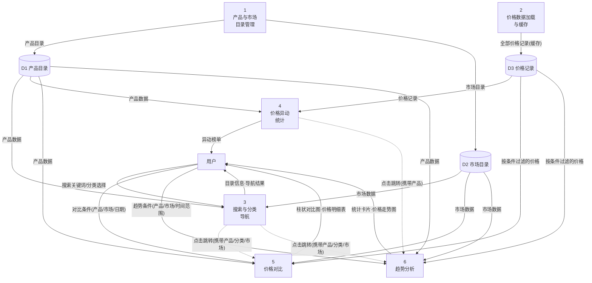
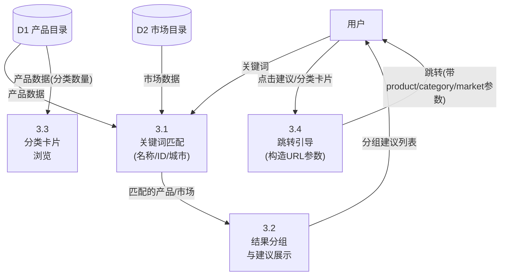
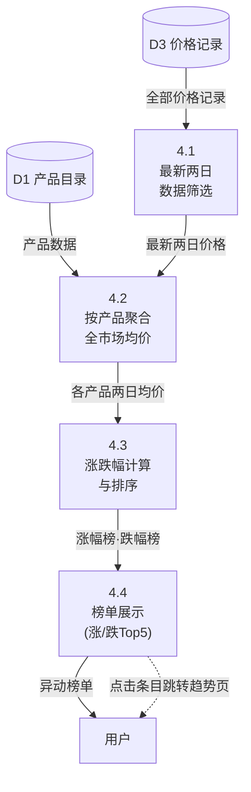
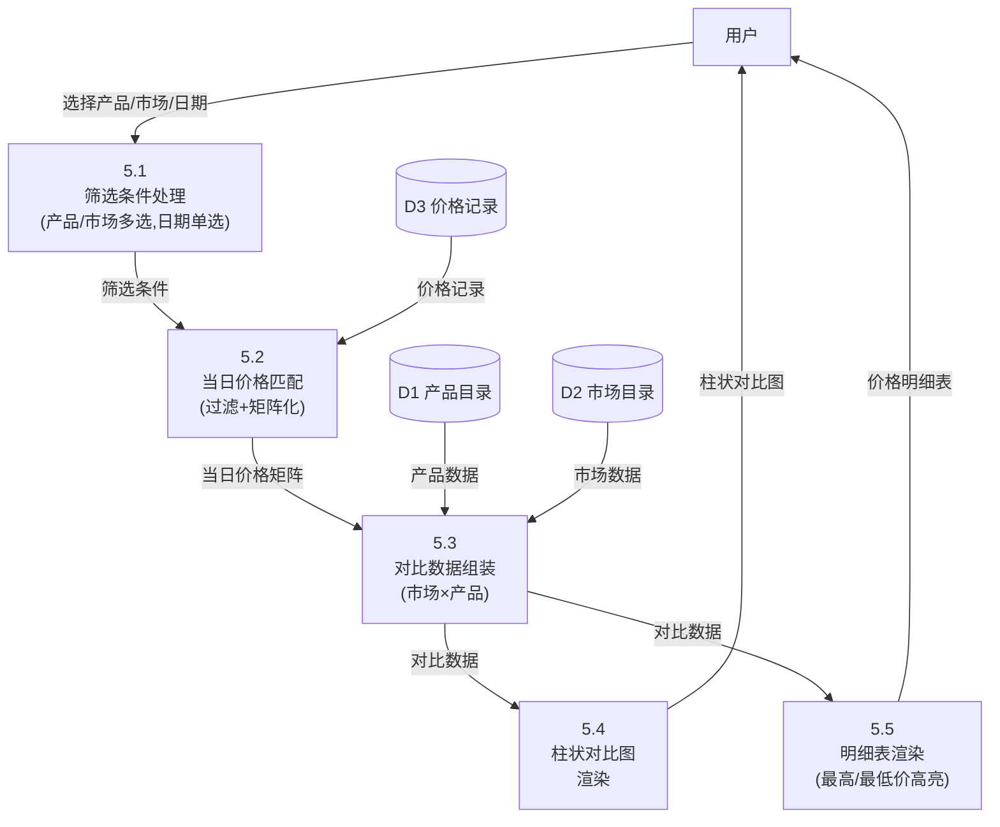
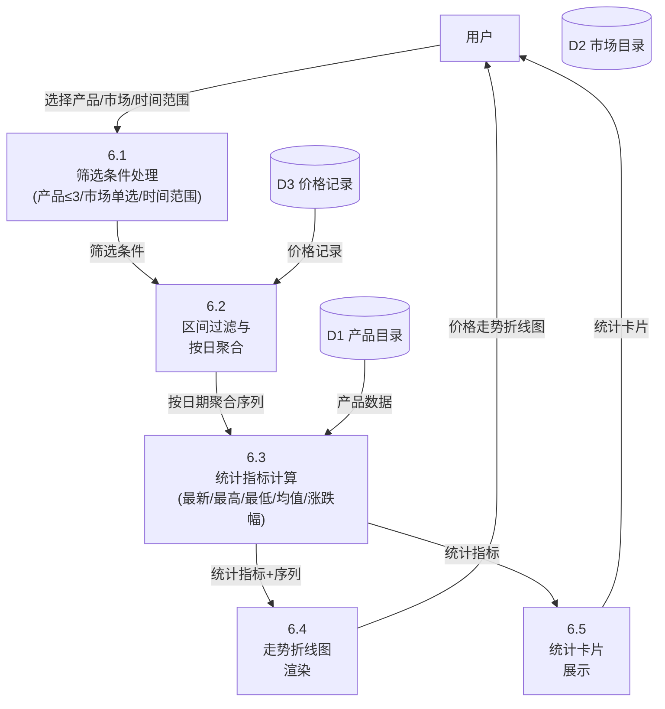
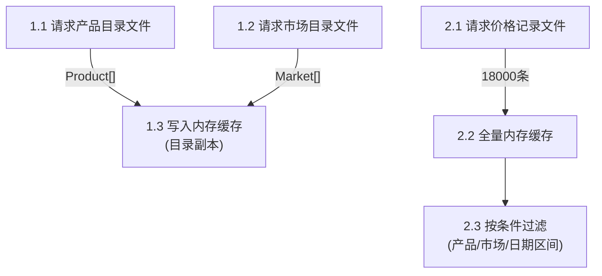

# 农价通(agri-price-tracker)数据流图(DFD)与功能分解

> 项目名称:农价通 —— 农产品价格对比与趋势分析系统
> 文档编号:DFD-03
> 版本:V1.0
> 日期:2026-09-21
> 方法:结构化分析(SA),数据流图自顶向下逐层分解

---

## 1. 概述

### 1.1 分析目标

采用结构化分析方法,以**数据流图(Data Flow Diagram, DFD)**为工具,对系统进行自顶向下的功能分解:

1. **顶层图(上下文图)**:确定系统边界与外部实体;
2. **0 层图**:将系统分解为 6 个主要加工与 3 个数据存储;
3. **1 层图**:对 0 层图中的主要加工进一步细化,直至加工可用一个模块清晰实现为止。

### 1.2 图例约定

| 记号 | 含义 | 本项目对应 |
|---|---|---|
| 矩形 | 外部实体(数据源/终点) | 用户(浏览者) |
| 圆角矩形 | 加工(处理逻辑) | 编号 1 ~ 6 及 3.x / 4.x / 5.x / 6.x |
| 双横杠(数据库形) | 数据存储 | D1 产品目录、D2 市场目录、D3 价格记录 |
| 带标注箭头 | 数据流(数据内容) | 如"查询条件""对比结果" |

### 1.3 编号规则

- 顶层图:系统记为 **0**;
- 0 层图:加工编号 **1 ~ 6**;
- 1 层图:加工 X 的分解编号 **X.1、X.2、…**;
- 数据存储编号 **D1 ~ D3**。

---

## 2. 顶层数据流图(上下文图)

确定系统边界:外部实体只有**用户**;系统对外提供查询服务,不产生持久化写操作。


**说明**:

- 输入数据流"查询条件"包含:搜索关键词、分类选择、产品选择、市场选择、日期、时间范围;
- 输出数据流"查询结果"包含:产品/市场目录、异动榜单、柱状对比图与明细表、统计卡片与折线图;
- 系统为**纯查询型**系统,无外部写入实体。

---

## 3. 0 层数据流图

将系统分解为 6 个加工、3 个数据存储:

| 加工编号 | 名称 | 对应实现 |
|---|---|---|
| 1 | 产品与市场目录管理 | `api.ts:getProducts/getMarkets` |
| 2 | 价格数据加载与缓存 | `api.ts:getPrices` |
| 3 | 搜索与分类导航 | `Home + SearchBar + CategoryGrid` |
| 4 | 价格异动统计 | `Home + MoverList` |
| 5 | 价格对比 | `PriceCompare 页及其组件` |
| 6 | 趋势分析 | `TrendAnalysis 页及其组件` |

| 存储编号 | 名称 | 对应文件 | 内容 |
|---|---|---|---|
| D1 | 产品目录 | products.json | 20 种农产品 |
| D2 | 市场目录 | markets.json | 10 个批发市场 |
| D3 | 价格记录 | prices.json | 18,000 条价格记录 |



**说明**:

1. 加工 1、2 为**数据准备**加工:页面初始化时执行,结果写入内存缓存(D1~D3 在实现中为内存态副本);
2. 加工 3、4 为**首页**功能,加工 5、6 为**分析页**功能;
3. 虚线箭头为页面跳转控制流(结构化方法中控制流一般不画,此处标注仅为说明首页到分析页的引导关系);
4. 各加工从 D1~D3 读取数据、完成过滤聚合后,直接向用户输出结果,中间结果不落存储。

---

## 4. 1 层数据流图(功能分解)

### 4.1 加工 3「搜索与分类导航」的分解



**分解说明**:

- **3.1 关键词匹配**:输入关键词,在产品(按 name/id)与市场(按 name/city)中做包含匹配;
- **3.2 结果分组展示**:匹配结果按"产品 / 市场"分组渲染下拉建议;
- **3.3 分类卡片浏览**:按 5 大分类统计产品数量并渲染入口卡片;
- **3.4 跳转引导**:点击产品 → 趋势页(`?product=ID`);点击市场 → 对比页(`?market=ID`);点击分类 → 趋势页(`?category=分类`)。

### 4.2 加工 4「价格异动统计」的分解



**分解说明**:

- **4.1**:对价格记录按日期分组,取字典序最大的两个日期(最新交易日与前一日);
- **4.2**:对每个产品分别聚合两日的全市场均价(某日某产品所有市场价格的算术平均);
- **4.3**:涨跌幅 = (最新均价 − 前一日均价)/前一日均价 × 100%,降序排序;
- **4.4**:涨幅榜取涨跌幅 > 0 的前 5 名,跌幅榜取 < 0 的绝对值前 5 名,涨红跌绿渲染。

### 4.3 加工 5「价格对比」的分解



**分解说明**:

- **5.1**:维护产品多选、市场多选、日期单选状态;日期选择范围受数据边界(最早/最晚日期)限制;
- **5.2**:遍历价格记录,过滤出 `date = 所选日期` 且 productId、marketId 均在选中集合内的记录,构建 `marketId → (productId → price)` 两级映射;
- **5.3**:组装"市场 × 产品"对比矩阵,缺失记录以空值(null)占位,保持选择顺序;
- **5.4**:柱状图按产品分组,每组内每市场一柱;柱色取产品色,深浅区分市场;
- **5.5**:明细表行 = 市场、列 = 产品;对每个产品列求当日最高价(标红)、最低价(标绿)。

### 4.4 加工 6「趋势分析」的分解



**分解说明**:

- **6.1**:产品多选(上限 3)、市场单选、时间范围单选(近 7/30/90/365 天,默认 30 天);起始日期 = 最新日期 − (范围 − 1) 天;
- **6.2**:过滤出区间内、选中市场、选中产品的记录,按日期分组,形成每产品 × 每日期一条价格的序列(日期升序);
- **6.3**:对每个产品计算:最新价、区间最高价、最低价、均价、区间涨跌幅((末期 − 首期)/首期 × 100%);
- **6.4**:以日期为横轴、价格为纵轴渲染多系列折线图(每产品一条线,颜色取产品色板);
- **6.5**:每产品一张统计卡片,展示 6.3 的五个指标。

### 4.5 加工 1、2(数据准备)的分解

加工 1、2 逻辑简单,合并给出分解:



**分解说明**:

- 1.1/1.2:并发请求 `products.json`、`markets.json`;
- 2.1:请求 `prices.json`(约 1.4MB);
- 2.2:整个会话只请求一次,缓存于内存;
- 2.3:按 `PriceQuery`(产品集合、市场集合、起止日期)在内存过滤,返回结果副本;该加工是加工 5、6 的数据输入通道。

---

## 5. 数据字典(DFD 相关条目)

### 5.1 数据流条目

| 名称 | 来源 | 去向 | 组成 |
|---|---|---|---|
| 查询条件 | 用户 | 加工 3/5/6 | 关键词 \| 分类 \| 产品ID集合 \| 市场ID集合 \| 日期 \| 时间范围 |
| 目录信息 | 加工 3 | 用户 | 产品ID+名称+分类 \| 市场ID+名称+城市 |
| 异动榜单 | 加工 4 | 用户 | 产品名+最新均价+涨跌幅% ×(≤5) × 2(涨/跌) |
| 柱状对比图 | 加工 5.4 | 用户 | 产品分组 × 市场系列 × 当日价格 |
| 价格明细表 | 加工 5.5 | 用户 | 市场行 × 产品列矩阵 + 最高/最低价标记 |
| 统计卡片 | 加工 6.5 | 用户 | 产品名+最新价+最高价+最低价+均价+涨跌幅% |
| 价格走势图 | 加工 6.4 | 用户 | 日期序列 × 产品价格序列(折线) |
| 价格记录(缓存) | 加工 2 | 加工 4/5/6 | ProductID + MarketID + Date + Price |
| 跳转参数 | 加工 3.4/4 | 加工 5/6 | product \| category \| market(URL 查询参数) |

### 5.2 数据存储条目

| 编号 | 名称 | 组成 | 数据量 | 访问加工 |
|---|---|---|---|---|
| D1 | 产品目录 | id + name + category + unit + basePrice | 20 条 | 1,3,4,5,6 |
| D2 | 市场目录 | id + name + city + region | 10 条 | 1,3,5,6 |
| D3 | 价格记录 | productId + marketId + date + price | 18,000 条 | 2,4,5,6 |

### 5.3 加工说明(小说明)

| 编号 | 加工名 | 输入 | 处理逻辑摘要 | 输出 |
|---|---|---|---|---|
| 1 | 产品与市场目录管理 | 数据文件 | fetch 两目录文件,缓存 | Product[]、Market[] |
| 2 | 价格数据加载与缓存 | 数据文件 | fetch 一次 + 内存缓存 + 条件过滤 | 过滤后 PriceRecord[] |
| 3 | 搜索与分类导航 | 关键词/分类 | 包含匹配、分组展示、构造 URL 跳转 | 建议列表、跳转 |
| 4 | 价格异动统计 | 全部价格 | 最新两日 × 全市场均价 → 涨跌幅排序 | 涨/跌 Top5 |
| 5 | 价格对比 | 筛选条件 | 当日过滤 → 矩阵组装 → 图表/表格渲染 | 柱状图、明细表 |
| 6 | 趋势分析 | 筛选条件 | 区间过滤 → 按日聚合 → 统计指标 → 渲染 | 折线图、统计卡片 |

---

## 6. 功能分解结论

自顶向下分解共三层:

```
系统(0)
├── 1 产品与市场目录管理 ── 1.1/1.2/1.3(3 个子加工)
├── 2 价格数据加载与缓存 ── 2.1/2.2/2.3(3 个子加工)
├── 3 搜索与分类导航 ──── 3.1~3.4(4 个子加工)
├── 4 价格异动统计 ────── 4.1~4.4(4 个子加工)
├── 5 价格对比 ────────── 5.1~5.5(5 个子加工)
└── 6 趋势分析 ────────── 6.1~6.5(5 个子加工)
```

合计 6 个主加工、24 个子加工、3 个数据存储、1 个外部实体。每个叶子加工均可直接映射为一个函数或组件,满足"加工单一、职责明确"的分解准则,可作为总体设计与详细设计的输入(见文档 04、05)。
