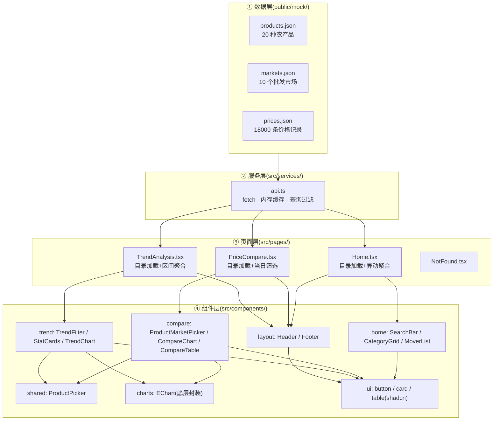
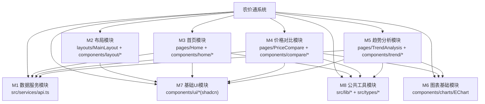
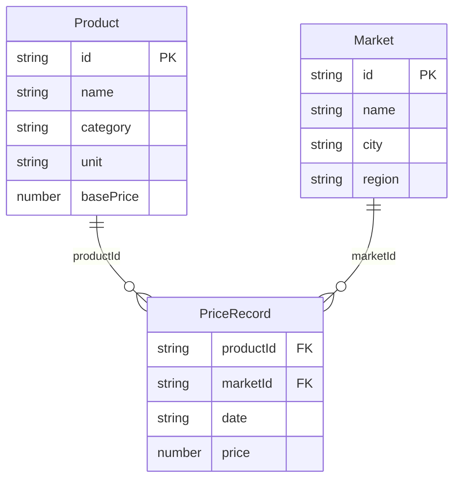
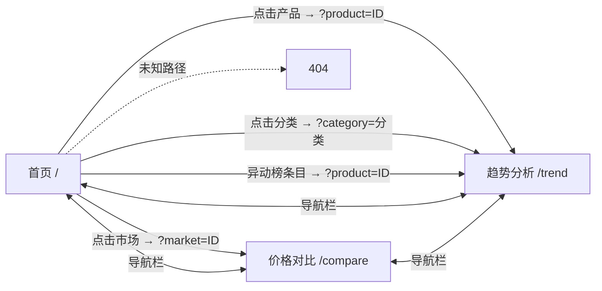

# 农价通(agri-price-tracker)总体设计说明书

> 项目名称:农价通 —— 农产品价格对比与趋势分析系统
> 文档编号:PDD-04
> 版本:V1.0
> 日期:2026-09-21
> 输入文档:《需求规格说明书》(SRS-02)、《数据流图》(DFD-03)

---

## 1. 引言

### 1.1 编写目的

依据需求规格说明书与数据流图,给出系统的**总体设计**:体系结构、模块划分、模块接口、数据设计、界面导航与运行环境,作为详细设计的直接依据。

### 1.2 设计目标

1. **分层解耦**:数据访问与业务逻辑、界面展示分离,替换真实数据源只改一个文件;
2. **可维护性**:类型集中管理、组件单一职责、目录按功能域组织;
3. **性能**:价格数据全量只请求一次,内存过滤;路由与图表按需加载;
4. **可移植性**:纯静态产物,任意静态托管可部署。

### 1.3 设计约束

- 技术栈限定:React 18 + TypeScript + Vite + Tailwind CSS + ECharts + react-router-dom;
- 数据为静态 JSON mock,不得引入后端服务;
- 中文界面,价格单位"元/公斤"。

---

## 2. 体系结构设计

### 2.1 分层架构

系统采用经典前端四层结构:**数据层 → 服务层 → 页面层 → 组件层**,单向依赖(上层依赖下层接口,不反向依赖实现):



### 2.2 各层职责与设计原则

| 层 | 位置 | 职责 | 关键原则 |
|---|---|---|---|
| 数据层 | `public/mock/` | 原始数据,构建时原样复制进产物 | 数据与代码分离,可重新生成 |
| 服务层 | `src/services/api.ts` | **唯一数据入口**:请求、缓存、按条件过滤 | 页面层禁止直接 fetch |
| 页面层 | `src/pages/` | 加载数据、管理选中状态、`useMemo` 聚合原始记录 | 不渲染细节 UI,只编排组件 |
| 组件层 | `src/components/` | 纯展示 + 事件回调 | 不直接 fetch 数据(props down, events up) |

### 2.3 数据流向

```
数据文件 → api.ts(fetch/缓存/过滤) → 页面(useState 持有 + useMemo 聚合)
        → 组件(props 传入) → 用户界面
用户操作 → 组件回调(onChange/onToggle) → 页面 setState → useMemo 重算 → 组件重渲染
```

---

## 3. 模块划分

### 3.1 模块结构图



### 3.2 模块清单

| 模块 | 主要文件 | 功能 | 依赖 |
|---|---|---|---|
| M1 数据服务 | `src/services/api.ts` | 请求三类数据、内存缓存、条件过滤 | M8(类型) |
| M2 布局 | `src/layouts/MainLayout.tsx`、`components/layout/{Header,Footer}.tsx` | 全局导航栏(页面切换、移动端汉堡菜单)、页脚 | M7 |
| M3 首页 | `src/pages/Home.tsx`、`components/home/{SearchBar,CategoryGrid,MoverList}.tsx` | 搜索建议、分类入口、价格异动榜 | M1、M7、M8 |
| M4 价格对比 | `src/pages/PriceCompare.tsx`、`components/compare/{ProductMarketPicker,CompareChart,CompareTable}.tsx` | 筛选器、当日价格矩阵组装、柱状图、明细表 | M1、M6、M7、M8 |
| M5 趋势分析 | `src/pages/TrendAnalysis.tsx`、`components/trend/{TrendFilter,StatCards,TrendChart}.tsx` | 筛选器、区间聚合、统计指标、折线图 | M1、M6、M7、M8 |
| M6 图表基础 | `src/components/charts/EChart.tsx` | ECharts 初始化/更新/销毁封装,按需注册组件 | echarts |
| M7 基础 UI | `src/components/ui/{button,card,table}.tsx` | shadcn 风格基础组件 | radix-slot、CVA |
| M8 公共工具 | `src/lib/{date,chartColors,utils}.ts`、`src/types/*` | 日期工具、图表色板、类名合并、全局类型 | 无 |
| M9 路由 | `src/App.tsx`、`src/main.tsx` | 路由表、懒加载、SPA 入口 | react-router-dom |

---

## 4. 模块接口设计

### 4.1 M1 数据服务接口(对外唯一数据契约)

```ts
// src/services/api.ts
getProducts(): Promise<Product[]>                          // 产品目录
getMarkets():  Promise<Market[]>                           // 市场目录
getPrices(query?: PriceQuery): Promise<PriceRecord[]>      // 按条件过滤的价格

interface PriceQuery {
  productIds?: string[]   // 为空 = 不过滤
  marketIds?:  string[]
  startDate?:  string     // YYYY-MM-DD,含边界
  endDate?:    string
}
```

### 4.2 页面层聚合输出(供组件消费)

| 输出 | 产生页面 | 结构 |
|---|---|---|
| MoverRow | Home | `{ product, latest, changePct }` |
| CompareDatum | PriceCompare | `{ market, prices: { product, price \| null }[] }` |
| StatCardData | TrendAnalysis | `{ product, values, latest, max, min, avg, changePct }` |

### 4.3 组件接口(主要 props,均为单向数据流)

| 组件 | 主要 Props | 主要回调 |
|---|---|---|
| SearchBar | `products, markets` | `(内部处理跳转)` |
| CategoryGrid | `products` | — |
| MoverList | `gainers, losers` | `(内部处理跳转)` |
| ProductMarketPicker | `products, markets, selectedProductIds, selectedMarketIds, date, minDate, maxDate` | `onProductToggle, onMarketToggle, onDateChange` |
| ProductPicker(共用) | 同上产品部分 | `onProductToggle` |
| CompareChart | `data: CompareDatum[], products` | — |
| CompareTable | `data: CompareDatum[], products` | — |
| TrendFilter | `products, markets, selectedProductIds, selectedMarketId, rangeDays` | `onProductToggle, onMarketChange, onRangeChange` |
| StatCards | `data: StatCardData[]` | — |
| TrendChart | `dates: string[], series: StatCardData[]` | — |
| EChart | `option: EChartsOption, height?` | — |

---

## 5. 数据设计

### 5.1 逻辑数据模型

三份静态 JSON 文件构成系统的持久数据(演示期)。逻辑结构:



### 5.2 数据规模与存储形式

| 文件 | 条数 | 格式 | 体积 |
|---|---|---|---|
| products.json | 20 | 格式化 JSON(易读) | 小 |
| markets.json | 10 | 格式化 JSON | 小 |
| prices.json | 18,000 | 紧凑单行 JSON | ≈1.4MB |

### 5.3 内存数据组织

- 服务层:`pricesCache` 全量缓存价格数组,过滤后返回新数组(不改缓存);
- 页面层:
  - 对比页:`Map<marketId, Map<productId, price>>` 两级映射加速矩阵查找;
  - 趋势页:`Map<date, Map<productId, price>>` 按日两级映射;
  - 首页:`Map<date, Map<productId, number[]>>` 支持同日同产品多市场价格聚合。

### 5.4 数据一致性规则

- 日期统一 `YYYY-MM-DD` 字符串,字典序比较即时间先后;
- 价格保留 2 位小数,展示时 `toFixed(2)`;
- 缺失数据(某市场某日无某产品)在矩阵中以 `null` 占位,图表与表格做空值容错。

---

## 6. 界面与导航设计

### 6.1 路由表

| 路径 | 页面 | 说明 |
|---|---|---|
| `/` | Home 首页 | 搜索、分类、异动榜 |
| `/compare` | PriceCompare 价格对比 | 支持 `?market=ID` |
| `/trend` | TrendAnalysis 趋势分析 | 支持 `?product=ID`、`?category=分类`、`?market=ID` |
| `*` | NotFound | 404 提示 |

三个主页面均通过 `React.lazy` 懒加载,按路由分包。

### 6.2 页面流转图



### 6.3 页面布局结构

- **全局**:Header(品牌"农价通" + 导航)在上,内容区居中(最大宽度 7xl),Footer 在底;
- **首页**:Hero(标题 + 搜索框)→ 分类卡片网格 → 异动榜(涨/跌两列);
- **对比页**:页头 → 筛选器 → 柱状图卡片 → 明细表卡片;
- **趋势页**:页头 → 筛选器 → 统计卡片行 → 折线图卡片。

---

## 7. 运行环境

| 项 | 内容 |
|---|---|
| 开发环境 | Node.js 18+、npm、VS Code |
| 浏览器 | Chrome / Edge / Firefox(现代版本,支持 ES2020+) |
| 构建 | `npm run build`(Vite 7)→ `dist/` 静态产物 |
| 部署 | 任意静态托管(Netlify/Vercel/Nginx);SPA 深链接依赖 `_redirects`(`/* /index.html 200`) |
| 服务端 | 无 |

---

## 8. 出错处理设计

| 出错类别 | 处理策略 | 呈现 |
|---|---|---|
| 数据文件请求失败(网络/404) | api.ts 抛出带状态码的 Error;页面捕获写入 error 状态 | 页面中央红色提示"数据加载失败:<原因>" |
| 数据加载中 | products 为空时渲染占位卡片 | "数据加载中…" |
| 筛选条件不满足(未选产品/市场) | 页面条件渲染 | "请至少选择 1 个产品和 1 个市场" / "请至少选择 1 个产品" |
| 缺失价格记录 | 矩阵中以 null 占位 | 图表跳过该点,表格显示"—" |
| 无效 URL 参数(ID 不存在) | 校验后忽略,保持默认选择 | 无异常 |
| 未知路由 | 路由兜底 | 404 页面 |

---

## 9. 性能设计

| 设计点 | 措施 | 效果 |
|---|---|---|
| 数据下载 | 价格文件全量只请求一次,服务层内存缓存 | 后续查询零网络开销 |
| 计算 | 页面用 `useMemo` 缓存聚合结果,依赖(筛选条件)不变不重算 | 筛选响应 ≤ 200ms |
| 包体 | 路由懒加载(React.lazy)按页分包 | 首屏只加载当前页代码 |
| 包体 | ECharts 按需注册(Bar/Line/Grid/Legend/Tooltip/CanvasRenderer) | 不引入未用图表模块 |
| 渲染 | EChart 只 init 一次,option 变化用 `setOption(option, {notMerge:true})` 更新 | 避免重复初始化与旧系列残留 |

---

## 10. 与详细设计的衔接

总体设计确定的**8 个功能模块(M1~M8)**、**模块接口契约**(4.1~4.3)与**内存数据组织**(5.3)将作为《详细设计说明书》(DD-05)的输入,详细设计逐模块给出处理流程、伪代码与界面细节。
