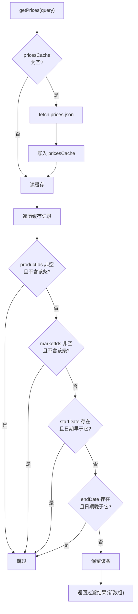
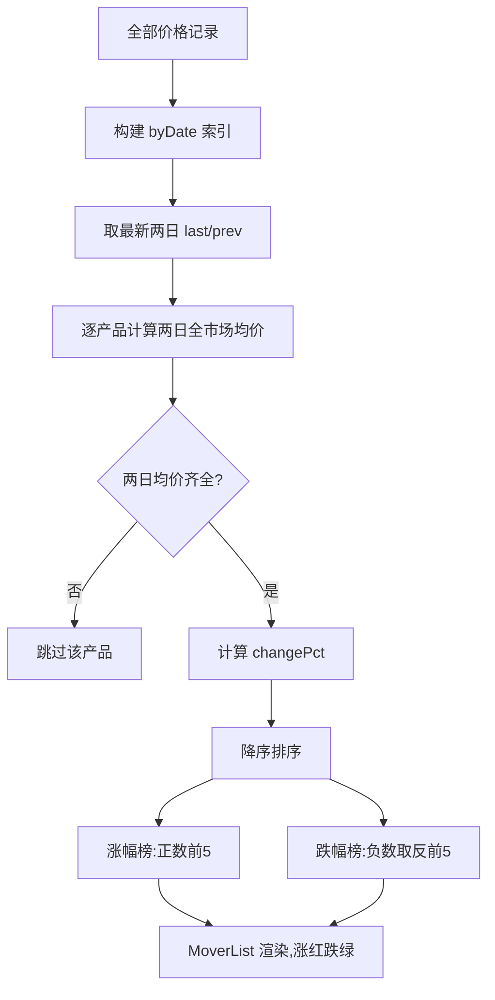
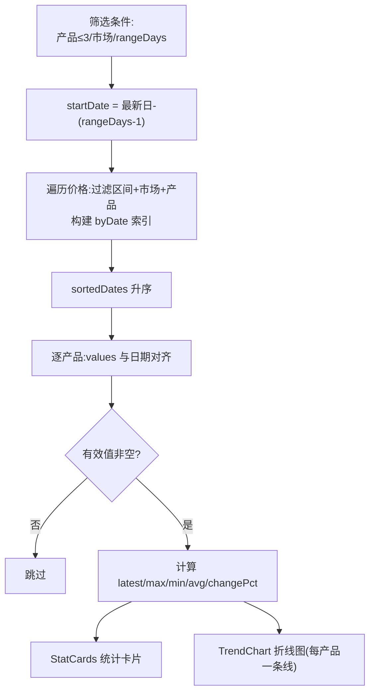

# 农价通(agri-price-tracker)详细设计说明书

> 项目名称:农价通 —— 农产品价格对比与趋势分析系统
> 文档编号:DD-05
> 版本:V1.0
> 日期:2026-09-21
> 输入文档:《总体设计说明书》(PDD-04)

---

## 1. 引言

### 1.1 编写目的

依据总体设计说明书,对 M1~M8 各模块进行详细设计:给出每个模块的处理流程(流程图)、关键算法(伪代码)与界面细节,可直接指导编码。

### 1.2 文档约定

- 伪代码采用类 TypeScript 风格,与实现文件一一对应;
- 流程图使用 mermaid flowchart,与 DFD 加工编号对应;
- 模块编号沿用总体设计(M1~M8)。

---

## 2. M1 数据服务模块(`src/services/api.ts`)

### 2.1 处理流程

对应 DFD 加工 1、2。模块内函数:

| 函数 | 功能 | 对应加工 |
|---|---|---|
| fetchJson | 通用 GET 请求 + 错误包装 | 1.1/1.2/2.1 |
| getProducts | 产品目录 | 1.1 |
| getMarkets | 市场目录 | 1.2 |
| getPrices | 价格全量缓存 + 条件过滤 | 2.2/2.3 |

### 2.2 getPrices 流程图



### 2.3 关键伪代码

```ts
let pricesCache: PriceRecord[] | null = null   // 模块级缓存

async function fetchJson<T>(path: string): Promise<T> {
  const res = await fetch(`${MOCK_BASE}/${path}`)
  if (!res.ok) throw new Error(`加载 ${path} 失败:${res.status}`)
  return res.json()
}

export async function getPrices(query: PriceQuery = {}): Promise<PriceRecord[]> {
  if (!pricesCache) {
    pricesCache = await fetchJson<PriceRecord[]>("prices.json")  // 全量只请求一次
  }
  return pricesCache.filter((r) => {
    if (query.productIds?.length && !query.productIds.includes(r.productId)) return false
    if (query.marketIds?.length  && !query.marketIds.includes(r.marketId))  return false
    if (query.startDate && r.date < query.startDate) return false
    if (query.endDate   && r.date > query.endDate)   return false
    return true
  })
}
```

### 2.4 设计要点

- **单点数据入口**:页面层只依赖三个函数的返回结构,替换真实 API 只改本文件;
- **缓存语义**:`pricesCache` 为模块级单例,多次调用共享;过滤返回新数组,缓存内容永不被修改;
- **日期比较**:`YYYY-MM-DD` 字符串直接字典序比较,等价于日期比较。

---

## 3. M3 首页模块

### 3.1 SearchBar 搜索建议(`components/home/SearchBar.tsx`)

**输入**:关键词 keyword;products(20)、markets(10)。

**算法**(对应加工 3.1/3.2):

```ts
matches = {
  products: products.filter(p =>
    p.name.includes(keyword) || p.id.includes(keyword)),      // 名称/ID 包含匹配
  markets: markets.filter(m =>
    m.name.includes(keyword) || m.city.includes(keyword)),    // 名称/城市包含匹配
}
// 分组渲染建议列表;空关键词时不显示
```

**跳转**(对应加工 3.4):

- 选中产品 p → `navigate('/trend?product=' + p.id)`
- 选中市场 m → `navigate('/compare?market=' + m.id)`

**界面设计**:输入框聚焦/有输入时显示分组下拉(产品组、市场组),每行显示名称与副信息(ID 或城市);点击外部关闭。

### 3.2 MoverList 异动榜聚合(`pages/Home.tsx` + `components/home/MoverList.tsx`)

**算法**(对应加工 4.1~4.4):

```ts
// 4.1:date -> productId -> prices[](多市场价格)
byDate: Map<date, Map<productId, number[]>>   // 一次遍历建立索引
dates = [...byDate.keys()].sort()             // 字典序升序
last = dates[末尾], prev = dates[倒数第二]      // 最新两个交易日

// 4.2/4.3:逐产品计算
for p in products:
  todayAvg     = mean(byDate[last][p.id])      // 全市场均价(最新日)
  yesterdayAvg = mean(byDate[prev][p.id])
  if todayAvg 为空 或 yesterdayAvg 为空: continue
  rows.push({ product: p,
              latest: todayAvg,
              changePct: (todayAvg - yesterdayAvg) / yesterdayAvg * 100 })

// 4.4
rows.sort(by changePct 降序)
gainers = rows 中 changePct > 0 的前 5 名
losers  = rows 中 changePct < 0 的后 5 名(反转后即跌幅前 5)
```

**流程图**:



**界面设计**:两个榜单并排(移动端上下):左"涨幅榜"、右"跌幅榜",每行:产品名 + 最新均价 + 涨跌幅徽标;点击行跳转趋势页 `?product=ID`。

### 3.3 CategoryGrid 分类入口

输入 products,按 `PRODUCT_CATEGORIES`(蔬菜/水果/粮油/肉禽蛋/水产)统计各类数量,渲染 5 张入口卡片(图标 + 分类名 + 产品数);点击跳转 `/trend?category=<分类>`。

---

## 4. M4 价格对比模块

### 4.1 状态设计(`pages/PriceCompare.tsx`)

| 状态 | 类型 | 初始值 |
|---|---|---|
| products / markets / allPrices | 数据状态 | 空 / 空 / null |
| selectedProductIds | string[] | `[pork, egg, cabbage]` |
| selectedMarketIds | string[] | 5 个默认市场 ID |
| date | string | 数据加载后设为最新日期 |

### 4.2 当日价格匹配(对应加工 5.2)

```ts
// marketId -> productId -> price,只含所选日期+所选产品+所选市场
priceMap: Map<marketId, Map<productId, price>>
for r in allPrices:
  if r.date != date: continue
  if r.productId ∉ selectedProductIds: continue
  if r.marketId ∉ selectedMarketIds: continue
  priceMap[r.marketId][r.productId] = r.price
```

### 4.3 对比数据组装(对应加工 5.3)

```ts
// 保持选择顺序:图表系列与表格列均按此排序
compareData: CompareDatum[] = selectedMarkets.map(m => ({
  market: m,
  prices: selectedProducts.map(p => ({
    product: p,
    price: priceMap.get(m.id)?.get(p.id) ?? null   // 缺失 → null 占位
  }))
}))
```

### 4.4 CompareChart 柱状图配置(对应加工 5.4)

```ts
// 按产品分组,每组内每市场一柱
series = selectedMarkets.map(m => ({
  name: m.name,
  type: "bar",
  data: compareData 中该市场的 prices 序列(null 按空处理)
}))
xAxis = 产品名数组
color  = 产品色板按深浅为不同市场分配同色系深浅(与明细表颜色一致)
tooltip 显示市场+产品+价格(元/公斤)
```

### 4.5 CompareTable 明细表与高亮(对应加工 5.5)

```ts
// 行 = 市场,列 = 产品,末行"最低/最高"汇总
for 每个产品列 col:
  values = 该列全部非空价格
  minIdx = values 中最小值的市场行
  maxIdx = values 中最大值的市场行
  行 minIdx 该单元格 → 绿色高亮
  行 maxIdx 该单元格 → 红色高亮
null 单元格 → "—"
```

**界面设计**:筛选器一行:产品选择区(标签式多选)+ 市场选择区(标签式多选)+ 日期选择框(受 minDate/maxDate 限制);下方两个卡片:柱状对比图、价格明细表;表头为产品名,表体每行首列为市场名。

---

## 5. M5 趋势分析模块

### 5.1 筛选与区间计算(`pages/TrendAnalysis.tsx`)

| 状态 | 类型 | 初始值 |
|---|---|---|
| selectedProductIds | string[] | `[pork, egg, cabbage]`(上限 3,由 TrendFilter 的 MAX_PRODUCTS 控制) |
| selectedMarketId | string | `bj_xinfadi`(单选) |
| rangeDays | 7\|30\|90\|365 | 30 |

```ts
maxDate   = allPrices 中最大日期
startDate = shiftDate(maxDate, -(rangeDays - 1))   // 以最新日为终点向前截取
```

URL 初始化(对应加工 6.1 的跳转场景):

```ts
productId 参数存在且有效 → 选中该单一产品
category  参数存在        → 选中该分类前 3 种产品(与上限 3 一致)
market    参数存在且有效  → 设为选中市场
```

### 5.2 区间聚合与统计(对应加工 6.2/6.3)

```ts
// 6.2:按日期聚合选中市场+产品
byDate: Map<date, Map<productId, price>>
for r in allPrices:
  if r.date < startDate: continue
  if r.marketId != selectedMarketId: continue
  if r.productId ∉ selectedProductIds: continue
  byDate[r.date][r.productId] = r.price
sortedDates = [...byDate.keys()].sort()          // 升序

// 6.3:每产品统计
for p in selectedProducts:
  values = sortedDates.map(d => byDate[d][p.id] ?? null)   // 与日期对齐
  nums   = values 中的非空值
  if nums 为空: continue
  first = nums[0], last = nums[末尾]
  stats.push({
    product: p, values,
    latest: last, max: max(nums), min: min(nums),
    avg: mean(nums),
    changePct: (last - first) / first * 100      // 区间涨跌幅
  })
```

**流程图**:



### 5.3 TrendChart 折线图配置

```ts
series = stats.map(s => ({
  name: s.product.name, type: "line",
  data: s.values, smooth: true,
  itemStyle/lineStyle 颜色 = 产品色板
}))
xAxis = dates(日期),yAxis = 价格(元/公斤)
```

### 5.4 StatCards 统计卡片

每产品一张卡片:产品名 + 色标 + 最新价 / 最高价 / 最低价 / 均价 / 区间涨跌幅(涨红跌绿);横向排列,移动端纵向。

---

## 6. M6 图表基础模块(`components/charts/EChart.tsx`)

### 6.1 生命周期设计

| 阶段 | 时机 | 动作 |
|---|---|---|
| 初始化 | 挂载时(空依赖 effect) | `echarts.init(el)`;注册 resize 监听 |
| 更新 | option 变化时 | `setOption(option, { notMerge: true })` |
| 销毁 | 卸载时 | 移除 resize 监听;`chart.dispose()`;引用置空 |

```ts
echarts.use([BarChart, LineChart, GridComponent, LegendComponent,
             TooltipComponent, CanvasRenderer])   // 按需注册,控制包体

useEffect(() => {          // 只执行一次:init + resize
  const chart = echarts.init(containerRef.current)
  window.addEventListener("resize", () => chart.resize())
  return () => { window.removeEventListener("resize", ...); chart.dispose() }
}, [])

useEffect(() => {          // option 每次变化:整体替换
  chartRef.current?.setOption(option, { notMerge: true })
}, [option])
```

**要点**:`notMerge: true` 防止切换筛选条件时旧系列残留在图上;图表容器 `width: 100%` + 固定高度(默认 360px)。

---

## 7. M8 公共工具模块

### 7.1 `src/lib/date.ts`

```ts
// 日期字符串(YYYY-MM-DD)加减天数,用于趋势区间起点计算
export function shiftDate(date: string, days: number): string {
  const d = new Date(date + "T00:00:00")
  d.setDate(d.getDate() + days)
  return `${y}-${mm}-${dd}`   // 补零后拼接,格式保持 YYYY-MM-DD
}
```

### 7.2 `src/lib/chartColors.ts`

固定色板(每产品一个主色,分类别),提供**同色系深浅变体**函数:对比页同一产品的不同市场柱使用主色与浅/深变体;趋势页每个产品一条线使用主色。色板与明细表高亮(红/绿)不冲突。

### 7.3 `src/lib/utils.ts`

`cn()`:clsx + tailwind-merge 类名合并(shadcn/ui 约定)。

### 7.4 类型模块 `src/types/`

| 文件 | 内容 |
|---|---|
| product.ts | `Product`、`ProductCategory`(字符串字面量联合,写错编译期报错)、`PRODUCT_CATEGORIES` 常量 |
| market.ts | `Market` |
| price.ts | `PriceRecord`、`PriceQuery`(全可选查询条件) |

---

## 8. 关键算法汇总

| 算法 | 位置 | 复杂度 | 说明 |
|---|---|---|---|
| 条件过滤 | api.ts getPrices | O(n),n=18000 | 单次线性扫描,四条件短路 |
| 异动聚合 | Home | O(n + p) | 一次遍历建索引 + 逐产品求均值 |
| 当日矩阵匹配 | PriceCompare | O(n) | 三条件过滤后两级 Map 写入 |
| 区间按日聚合 | TrendAnalysis | O(n) | 过滤 + Map 索引 |
| 统计指标 | TrendAnalysis | O(p·d) | 每产品沿日期序列线性扫描 |
| 最高/最低高亮 | CompareTable | O(p·m) | 每列扫描市场行求极值 |

所有聚合均置于 `useMemo` 中,依赖(筛选条件/原始数据)不变不重算。

---

## 9. 界面详细设计

### 9.1 全局布局

```
┌────────────────────────────────────────────┐
│ Header: 农价通   首页 | 价格对比 | 趋势分析  │   ← 窄屏折叠为汉堡菜单
├────────────────────────────────────────────┤
│              内容区(max-w-7xl 居中)          │
├────────────────────────────────────────────┤
│ Footer: 项目名 · 说明 · 年份                │
└────────────────────────────────────────────┘
```

### 9.2 首页布局

```
┌─────────────────────────────────────┐
│     农价通(标题+副标题)               │
│   [____搜索产品/市场____](下拉建议)    │
├─────────────────────────────────────┤
│ 按分类浏览: [蔬菜][水果][粮油]        │
│            [肉禽蛋][水产](含数量)      │
├─────────────────────────────────────┤
│ 价格异动:  涨幅榜 Top5 │ 跌幅榜 Top5  │
└─────────────────────────────────────┘
```

### 9.3 价格对比页布局

```
┌───────────────────────────────────────────────┐
│ 价格对比(标题)                                 │
│ 筛选器: 产品[猪肉✓ 鸡蛋✓ 大白菜✓ 白菜...]        │
│         市场[新发地✓ 江桥✓ 江南✓ ...]           │
│         日期[2026-09-21 ▾](受边界限制)          │
├───────────────────────────────────────────────┤
│ 各市场价格柱状对比(x=产品,系列=市场,深浅色区分)  │
├───────────────────────────────────────────────┤
│ 价格明细(行=市场,列=产品,最低绿/最高红)          │
└───────────────────────────────────────────────┘
```

### 9.4 趋势分析页布局

```
┌───────────────────────────────────────────────┐
│ 趋势分析(标题)                                 │
│ 筛选器: 产品[≤3个多选] 市场[单选] 范围[7|30|90|365天]│
├───────────────────────────────────────────────┤
│ 统计卡片: [猪肉:最新/最高/最低/均价/涨跌]        │
│           [鸡蛋: ...] [大白菜: ...]             │
├───────────────────────────────────────────────┤
│ 价格走势(折线图,x=日期,y=元/公斤,每产品一条线)   │
└───────────────────────────────────────────────┘
```

---

## 10. 设计审查清单

- [ ] 页面层是否存在直接 fetch 数据文件?(应只有 api.ts)
- [ ] 是否引入未注册的 ECharts 组件?(注册表见 6.1)
- [ ] 日期是否均为 `YYYY-MM-DD` 且用字典序比较?
- [ ] 缺失价格是否以 null 占位并在图表/表格中容错?
- [ ] 图表颜色是否与全站配色约定一致(涨红跌绿、产品色板)?
- [ ] 新增筛选条件是否加入 useMemo 依赖数组?

---

*全文完。本文档与《需求规格说明书》《数据流图》《总体设计说明书》共同构成"农价通"系统的完整软件工程文档集。*
